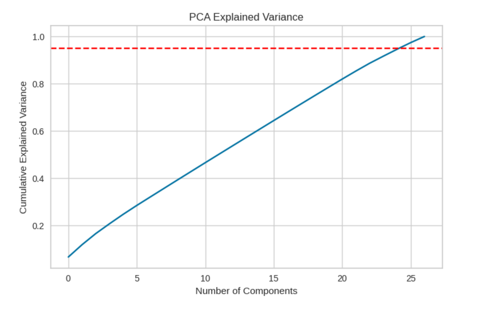
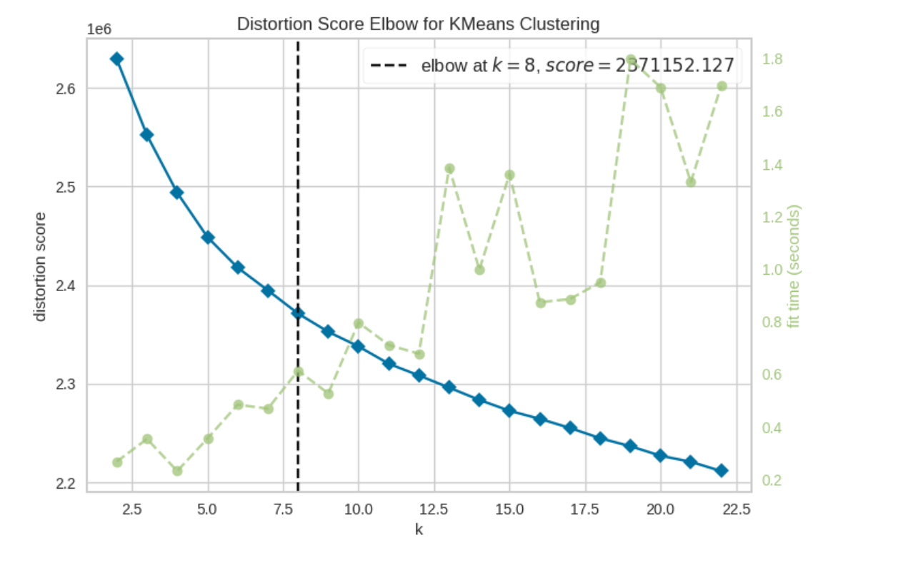
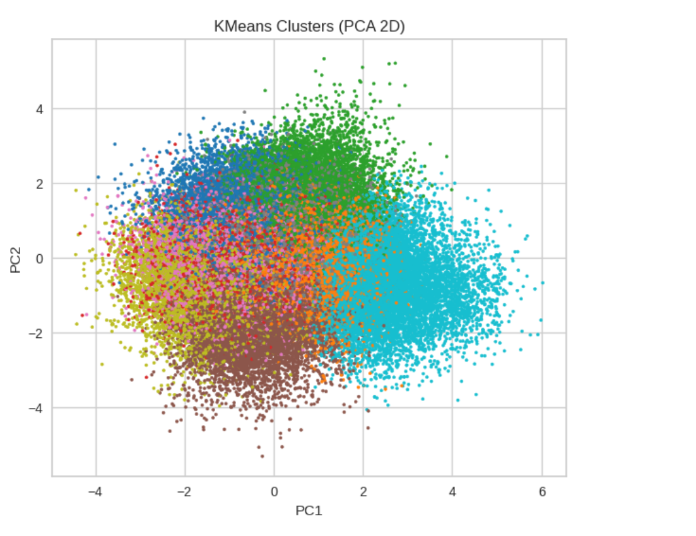

# 🧩 Clustering Predictor (KMeans / GMM)

🔗 **Live Demo:**(https://huggingface.co/spaces/EnYa32/UnsupervisedCustumerPrediction)

📓 **Kaggle Competition:** https://www.kaggle.com/code/enesyama/unsupervisedcustumer-clustering

## ⚡ Quick Facts

- Task: Unsupervised Clustering
- Models: KMeans + Gaussian Mixture Model
- Preprocessing: StandardScaler + PCA (95%)
- Input: Tabular CSV
- Output: Cluster Labels
- Deployment: Streamlit App
- Pipeline: Saved sklearn objects (.pkl)


## 🧠 Pipeline Structure

Raw Features  
→ StandardScaler  
→ PCA (95% variance)  
→ Clustering Model (KMeans / GMM)  
→ Cluster Label Prediction


## ✅ What this app does
- Upload a CSV file
- The app checks required feature columns
- Applies **scaler + PCA**
- Outputs **Predicted** cluster label for each row
- Lets you download the predictions as a CSV

## 📸 Model & Clustering Visualizations

### PCA Explained Variance


### KMeans Elbow Method


### Cluster Visualization (PCA 2D)


---

## 📊 Evaluation

Because this is an **unsupervised learning** project, evaluation is not based on labeled accuracy.

Model quality was evaluated using:

- Kaggle leaderboard score
- Cluster stability
- PCA visualization
- Distribution consistency across clusters

## 🛠️ Tech Stack

- Python
- scikit-learn
- PCA
- KMeans
- Gaussian Mixture Models
- Streamlit
- Pickle model persistence

## 📦 Required Model Artifacts

The following trained pipeline artifacts must exist in the repo root:

- feature_names.pkl
- scaler.pkl
- pca.pkl
- kmeans_model_k9.pkl
- gmm_model_k9.pkl

## 🧾 Input format
Your CSV must include all feature columns stored in `feature_names.pkl`.

Optional:
- You may include an `id` or `Id` column.  
  If present, it will be included in the output as `Id`.

## ▶️ Run locally

```bash
pip install -r requirements.txt
streamlit run app.py


Visual separation in 2D does not always reflect the Kaggle metric.

You can download the CSV file here:
https://www.kaggle.com/competitions/tabular-playground-series-jul-2022/data
